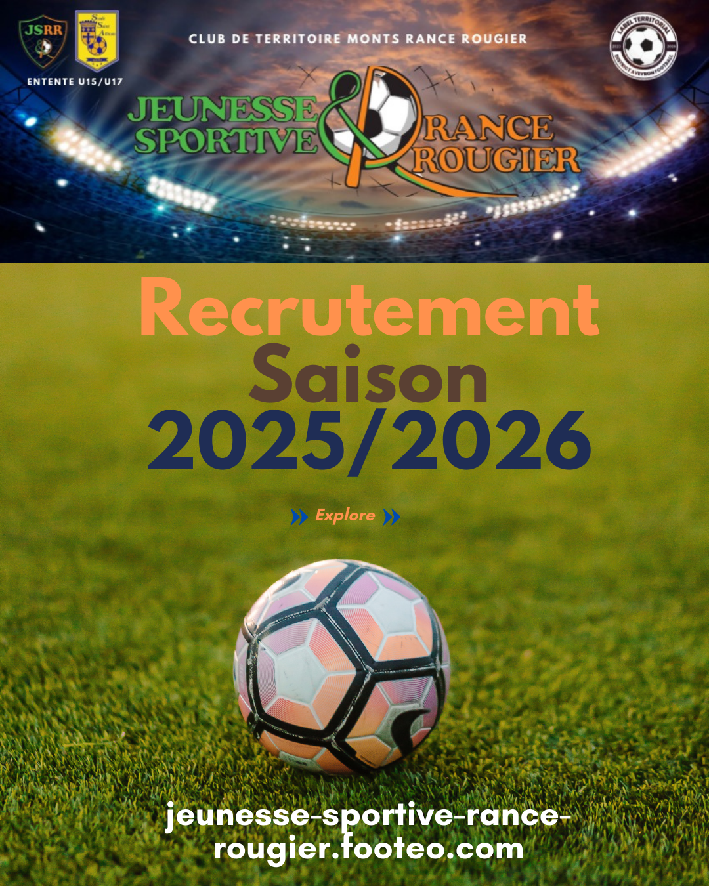
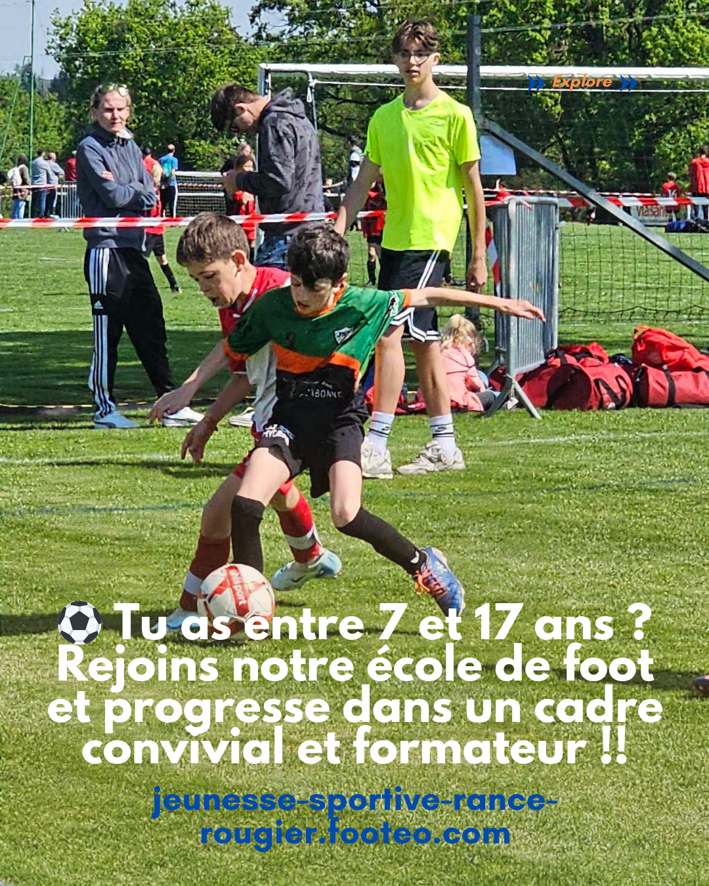
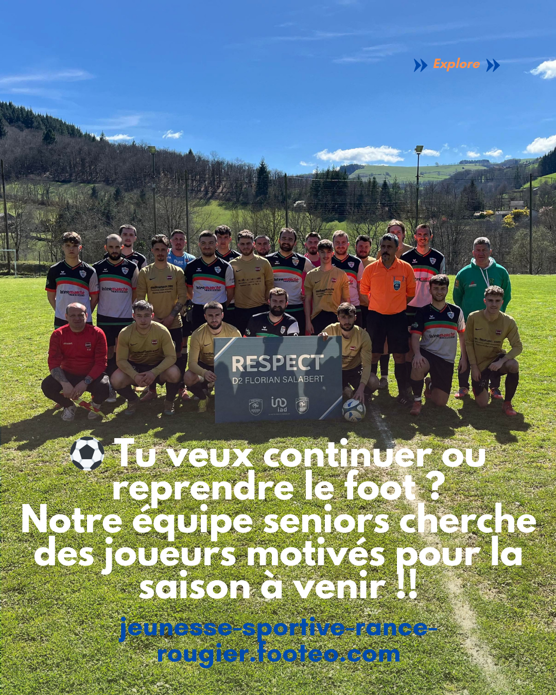
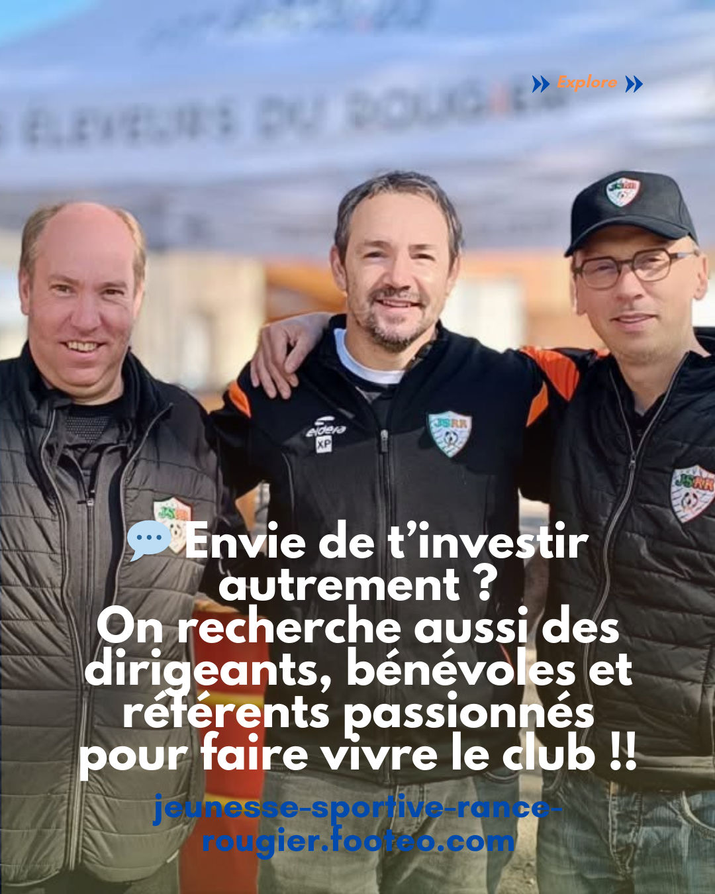
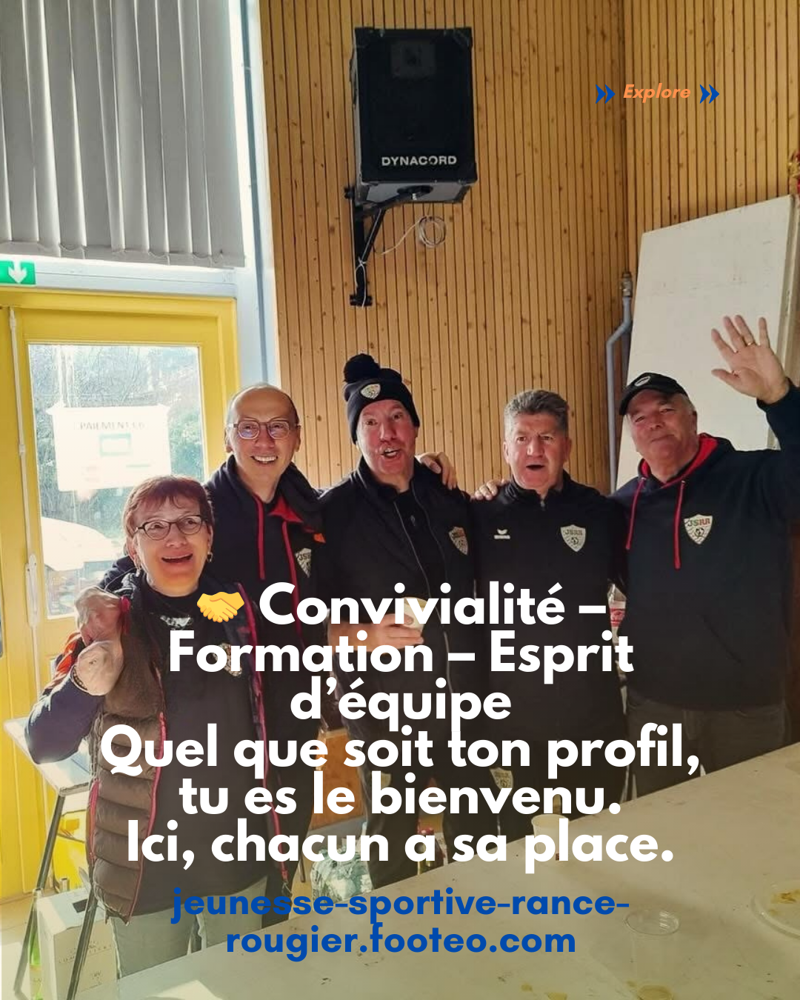
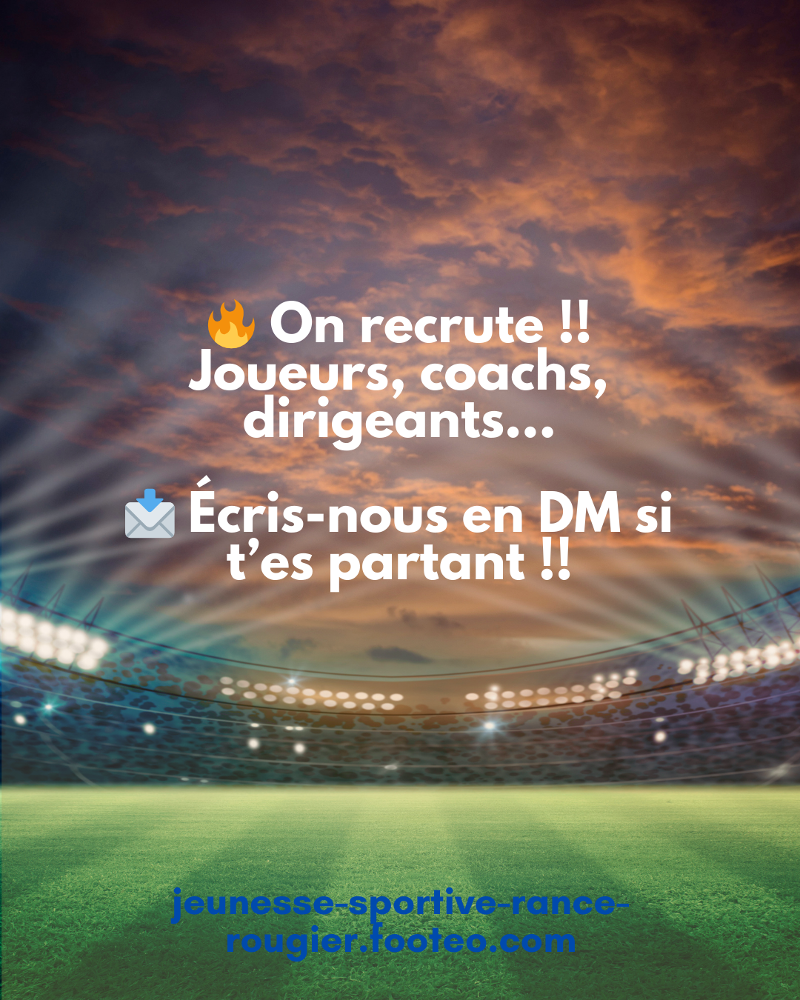

## Description

			</a>
			<a href="https://gregory-delmas-designer.fr">Accueil</a>  Fichier média		
					<h1>🎯 Carrousel de recrutement dynamique pour la JSRR</h1>				
		
Découvrez comment j’ai accompagné la <strong data-start="528" data-end="570">Jeunesse Sportive Rance Rougier (JSRR)</strong> dans la création d’un <strong data-start="593" data-end="626">carrousel Instagram dynamique</strong> pour le recrutement de joueurs et bénévoles, tout en renforçant l’image digitale du club.
		
					<h2>⚽ Objectif du projet : recruter et fédérer</h2>				
		
La JSRR, club de football amateur implanté localement, souhaitait :
<ul data-start="840" data-end="1090"><li data-start="840" data-end="920">
<strong data-start="842" data-end="874">Recruter de nouveaux joueurs</strong> pour l’école de foot et la section seniors.
</li><li data-start="921" data-end="988">
<strong data-start="923" data-end="959">Attirer des dirigeants bénévoles</strong> pour encadrer les équipes.
</li><li data-start="989" data-end="1090">
<strong data-start="991" data-end="1020">Valoriser l’image du club</strong> et ses valeurs : convivialité, esprit d’équipe et engagement local.
</li></ul>
L’objectif principal était de créer un <strong data-start="1131" data-end="1159">contenu visuel attractif</strong>, engageant et adapté aux réseaux sociaux pour maximiser l’impact du recrutement.
		
					<h3>🛠️ Ma mission : création d’un carrousel Instagram engageant</h3>				
		
En tant que <strong data-start="1324" data-end="1372">Webdesigner et créateur de contenus digitaux</strong>, j’ai accompagné le club dans toutes les étapes de conception du <strong data-start="1438" data-end="1486">carrousel de communication digitale sportive</strong>, avec pour objectifs : attirer l’attention, transmettre le message clairement et inciter à l’action.
		
					<section dir="ltr" data-slick="{&quot;rtl&quot;:false,&quot;infinite&quot;:true,&quot;speed&quot;:700,&quot;arrows&quot;:true,&quot;dots&quot;:true,&quot;autoplay&quot;:false,&quot;autoplaySpeed&quot;:0,&quot;pauseOnHover&quot;:&quot;&quot;,&quot;prevArrow&quot;:&quot;#wpr-grid-slider-prev-620efdf&quot;,&quot;nextArrow&quot;:&quot;#wpr-grid-slider-next-620efdf&quot;,&quot;sliderSlidesToScroll&quot;:2,&quot;sliderRows&quot;:1,&quot;lightbox&quot;:{&quot;selector&quot;:&quot;article:not(.slick-cloned) .wpr-grid-image-wrap&quot;,&quot;iframeMaxWidth&quot;:&quot;60%&quot;,&quot;hash&quot;:false,&quot;autoplay&quot;:&quot;true&quot;,&quot;pause&quot;:5000,&quot;progressBar&quot;:&quot;true&quot;,&quot;counter&quot;:&quot;true&quot;,&quot;controls&quot;:&quot;true&quot;,&quot;getCaptionFromTitleOrAlt&quot;:&quot;true&quot;,&quot;thumbnail&quot;:&quot;&quot;,&quot;showThumbByDefault&quot;:&quot;&quot;,&quot;share&quot;:&quot;&quot;,&quot;zoom&quot;:&quot;true&quot;,&quot;fullScreen&quot;:&quot;true&quot;,&quot;download&quot;:&quot;true&quot;}}"><article><h2><a  href="https://gregory-delmas-designer.fr/carrousel-recrutement-jsrr-page-1/">Carrousel recrutement JSRR page 1</a></h2></article><article><h2><a  href="https://gregory-delmas-designer.fr/carrousel-recrutement-jsrr-page-2/">Carrousel recrutement JSRR page 2</a></h2></article><article><h2><a  href="https://gregory-delmas-designer.fr/carrousel-recrutement-jsrr-page-3/">Carrousel recrutement JSRR page 3</a></h2></article><article><h2><a  href="https://gregory-delmas-designer.fr/carrousel-recrutement-jsrr-page-4/">Carrousel recrutement JSRR page 4</a></h2></article><article><h2><a  href="https://gregory-delmas-designer.fr/carrousel-recrutement-jsrr-page-5/">Carrousel recrutement JSRR page 5</a></h2></article><article><h2><a  href="https://gregory-delmas-designer.fr/carrousel-recrutement-jsrr-page-6/">Carrousel recrutement JSRR page 6</a></h2></article></section><svg version="1.1" xmlns="http://www.w3.org/2000/svg" xmlns:xlink="http://www.w3.org/1999/xlink" x="0px" y="0px" viewBox="0 0 283.4 512" style="enable-background:new 0 0 283.4 512;" xml:space="preserve"><g><polygon points="54.5,256.3 283.4,485.1 256.1,512.5 0,256.3 0,256.3 27.2,229 256.1,0 283.4,27.4 "/></g></svg><svg version="1.1" xmlns="http://www.w3.org/2000/svg" xmlns:xlink="http://www.w3.org/1999/xlink" x="0px" y="0px" viewBox="0 0 283.4 512" style="enable-background:new 0 0 283.4 512;" xml:space="preserve"><g><polygon points="54.5,256.3 283.4,485.1 256.1,512.5 0,256.3 0,256.3 27.2,229 256.1,0 283.4,27.4 "/></g></svg>				
		<h3 data-start="1594" data-end="1623">🔹 1. Analyse des besoins</h3><ul data-start="1625" data-end="1893"><li data-start="1625" data-end="1713">
Identifier les profils recherchés : joueurs de U7 à seniors, éducateurs, dirigeants.
</li><li data-start="1714" data-end="1823">
Comprendre les <strong data-start="1731" data-end="1765">valeurs et l’identité visuelle</strong> du club : esprit d’équipe, convivialité, ancrage local.
</li><li data-start="1824" data-end="1893">
Déterminer le ton et le style graphique adapté aux réseaux sociaux.
</li></ul><h3 data-start="1900" data-end="1941">🔹 2. Création graphique du carrousel</h3><ul data-start="1943" data-end="2645"><li data-start="1943" data-end="2028">
<strong data-start="1945" data-end="1991">Format optimisé pour Instagram et Facebook</strong> : 1080×1350 px, 5 slides au total.
</li><li data-start="2029" data-end="2132">
<strong data-start="2031" data-end="2054">Palette de couleurs</strong> : vert, orange et bleu, en cohérence avec les couleurs officielles du club.
</li><li data-start="2133" data-end="2206">
<strong data-start="2135" data-end="2157">Visuels dynamiques</strong> : photos de matchs, événements et vie du club.
</li><li data-start="2207" data-end="2278">
<strong data-start="2209" data-end="2244">Typographie lisible et sportive</strong> pour renforcer l’impact visuel.
</li><li data-start="2279" data-end="2645">
<strong data-start="2281" data-end="2314">Messages courts et percutants</strong> :
<ul data-start="2321" data-end="2645"><li data-start="2321" data-end="2445">
⚽ « Tu veux continuer ou reprendre le foot ? Notre équipe seniors cherche des joueurs motivés pour la saison à venir ! »
</li><li data-start="2448" data-end="2559">
💬 « Envie de t’investir autrement ? Rejoignez-nous comme dirigeants, bénévoles et référents passionnés ! »
</li><li data-start="2562" data-end="2645">
🤝 « Convivialité – Formation – Esprit d’équipe : chacun a sa place au club ! »
</li></ul></li></ul><h3 data-start="2652" data-end="2692">🔹 3. Optimisation pour l’engagement</h3><ul data-start="2694" data-end="3011"><li data-start="2694" data-end="2797">
<strong data-start="2696" data-end="2722">Appel à l’action clair</strong> sur la dernière slide : ➤ « 📩 Écris-nous en DM si tu es partant ! »
</li><li data-start="2798" data-end="2909">
Conception pensée pour <strong data-start="2823" data-end="2849">maximiser l’engagement</strong> et encourager les interactions sur Instagram et Facebook.
</li><li data-start="2910" data-end="3011">
Respect des bonnes pratiques de communication digitale sportive pour toucher efficacement la cible.
</li></ul><h2 data-start="3018" data-end="3059">🌟 Résultats et bénéfices pour le club</h2><ul data-start="3061" data-end="3299"><li data-start="3061" data-end="3111">
<strong data-start="3063" data-end="3108">Visibilité accrue sur les réseaux sociaux</strong>.
</li><li data-start="3112" data-end="3156">
<strong data-start="3114" data-end="3153">Engagement des joueurs et bénévoles</strong>.
</li><li data-start="3157" data-end="3228">
Contenu aligné avec l’<strong data-start="3181" data-end="3225">identité visuelle et les valeurs du club</strong>.
</li><li data-start="3229" data-end="3299">
<strong data-start="3231" data-end="3269">Communication moderne et dynamique</strong>, adaptée aux formats sociaux.
</li></ul>		
					<h3>.
📩 Vous voulez booster votre communication digitale ?</h3>				
		
Si vous êtes une association, un club sportif ou une entreprise et souhaitez <strong data-start="3441" data-end="3493">communiquer efficacement sur les réseaux sociaux</strong>, je peux vous aider à créer des <strong data-start="3526" data-end="3573">carrousels Instagram et Facebook attractifs</strong>, adaptés à votre identité et vos objectifs.
		
					<!-- Bloc CTA animé -->
  <!-- Bouton 1 : Guide gratuit -->
  <a href="https://gregory-delmas-webdesigner.systeme.io/guide-wordpress-gratuit" 
     style="
        display:inline-block;
        padding:15px 30px;
        margin:10px;
        background-color:#FF5722;
        color:#fff;
        font-weight:bold;
        text-decoration:none;
        border-radius:8px;
        opacity:0;
        transform:translateY(30px);
        animation: fadeSlide 1s forwards;
        animation-delay:0.3s;
        transition: background-color 0.3s ease;
     "
     onmouseover="this.style.backgroundColor='#e64a19';"
     onmouseout="this.style.backgroundColor='#FF5722';"
  >
    👉 Téléchargez mon guide gratuit « 5 erreurs WordPress à éviter »
  </a>
  <!-- Bouton 2 : Contact -->
  <a href="https://gregory-delmas-designer.fr/contact/" 
     style="
        display:inline-block;
        padding:15px 30px;
        margin:10px;
        background-color:#2196F3;
        color:#fff;
        font-weight:bold;
        text-decoration:none;
        border-radius:8px;
        opacity:0;
        transform:translateY(30px);
        animation: fadeSlide 1s forwards;
        animation-delay:0.6s;
        transition: background-color 0.3s ease;
     "
     onmouseover="this.style.backgroundColor='#1976D2';"
     onmouseout="this.style.backgroundColor='#2196F3';"
  >
    🚀 Contactez-moi directement
  </a>
<!-- Animations CSS -->

