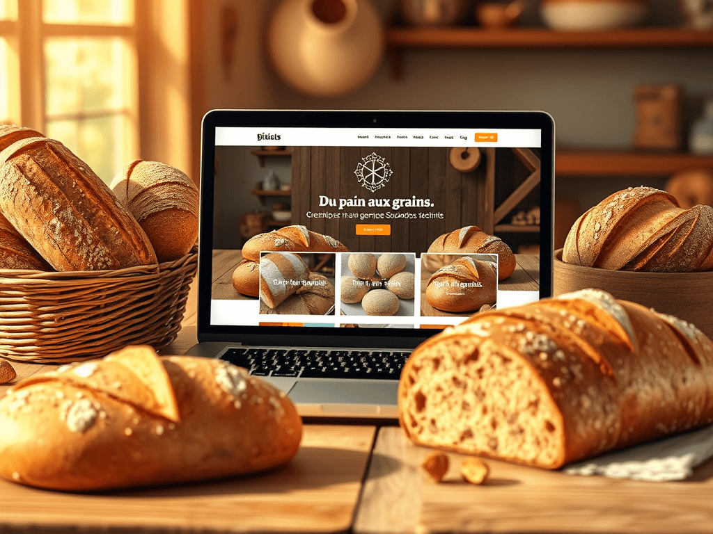

## Description

			</a>
			<a href="https://gregory-delmas-designer.fr">Accueuil</a>  Projet		
					<h1>🥖 Site web Du Pain aux Grains : artisanat, ateliers et saveurs en ligne</h1>				
					<h2>🍞 Découvrez le site web Du Pain aux Grains</h2>				
		
Le <strong data-start="648" data-end="679">site web Du Pain aux Grains</strong> met en lumière un univers artisanal engagé, autour du <strong data-start="734" data-end="762">pain biologique et local</strong>. 🌾 Chaque jour, ce projet célèbre le goût, le savoir-faire artisanal et l’agriculture biologique, en proposant une <strong data-start="879" data-end="916">expérience gourmande et éducative</strong> unique.

Visitez le site officiel : 👉 <a href="https://dupainauxgrain.fr" target="_new" rel="noopener" data-start="958" data-end="1004">dupainauxgrain.fr</a>
		
					<h2>🌱 Des ateliers pédagogiques et ludiques</h2>				
		
Le <strong data-start="1061" data-end="1088">site Du Pain aux Grains</strong> propose des <strong data-start="1101" data-end="1136">ateliers de fabrication du pain</strong>, retraçant toutes les étapes, <strong data-start="1167" data-end="1210">de l’agriculteur jusqu’au produit final</strong>. Ces ateliers sont conçus pour différentes structures :
<ul data-start="1269" data-end="1318"><li data-start="1269" data-end="1282">
Écoles 📚
</li><li data-start="1283" data-end="1305">
Centres sociaux 🤝
</li><li data-start="1306" data-end="1318">
EHPAD 🏥
</li></ul>
Les participants découvrent :
<ul data-start="1352" data-end="1518"><li data-start="1352" data-end="1405">
La culture du blé et les pratiques biologiques 🌱
</li><li data-start="1406" data-end="1456">
Le travail du fournil et la cuisson du pain 🔥
</li><li data-start="1457" data-end="1518">
Les techniques artisanales et recettes traditionnelles 🥖
</li></ul>
Cette approche éducative permet de <strong data-start="1555" data-end="1615">sensibiliser petits et grands à l’agriculture biologique</strong>, tout en partageant le plaisir du pain fait main.
		
					<h2>📸 Une expérience interactive et visuelle</h2>				
		
Le site met en avant un <strong data-start="1744" data-end="1764">fournil ambulant</strong> grâce à des <strong data-start="1777" data-end="1808">photos et vidéos immersives</strong> 🎥. Les visiteurs peuvent explorer :
<ul data-start="1848" data-end="1999"><li data-start="1848" data-end="1892">
Le parcours complet de la farine au pain
</li><li data-start="1893" data-end="1932">
Les ateliers pédagogiques en images
</li><li data-start="1933" data-end="1999">
Les témoignages et retours enthousiastes des participants 💬👍
</li></ul>
Une <strong data-start="2005" data-end="2026">carte interactive</strong> intégrée permet également de <strong data-start="2056" data-end="2116">localiser le fournil ambulant et les différents ateliers</strong>, offrant une expérience intuitive et engageante pour tous les visiteurs.
		
					<h2>✨ Une aventure gourmande à suivre</h2>				
												<figure>
											
											<figcaption>Site web DU PAIN AUX GRAINS</figcaption>
										</figure>
		
Le <strong data-start="2239" data-end="2270">site web Du Pain aux Grains</strong> combine :
<ul data-start="2283" data-end="2470"><li data-start="2283" data-end="2315">
Design attrayant et intuitif
</li><li data-start="2316" data-end="2348">
Contenu riche et pédagogique
</li><li data-start="2349" data-end="2400">
Interactivité grâce à Google Maps et animations
</li><li data-start="2401" data-end="2470">
Sensibilisation à l’agriculture biologique et à l’artisanat local
</li></ul>
Que vous soyez amateur de pain, enseignant, animateur ou simplement curieux, <strong data-start="2549" data-end="2571">Du Pain aux Grains</strong> propose un <strong data-start="2583" data-end="2614">voyage gourmand et éducatif</strong> unique, à découvrir en ligne.
		
					<h2>📩 Contactez-moi pour votre site web</h2>				
		
Vous souhaitez vous aussi <strong data-start="353" data-end="384">avoir votre propre site web</strong> ? N’hésitez pas à me contacter !
		
					<!-- Bloc CTA animé -->
  <!-- Bouton 1 : Guide gratuit -->
  <a href="https://gregory-delmas-webdesigner.systeme.io/guide-wordpress-gratuit" 
     style="
        display:inline-block;
        padding:15px 30px;
        margin:10px;
        background-color:#FF5722;
        color:#fff;
        font-weight:bold;
        text-decoration:none;
        border-radius:8px;
        opacity:0;
        transform:translateY(30px);
        animation: fadeSlide 1s forwards;
        animation-delay:0.3s;
        transition: background-color 0.3s ease;
     "
     onmouseover="this.style.backgroundColor='#e64a19';"
     onmouseout="this.style.backgroundColor='#FF5722';"
  >
    👉 Téléchargez mon guide gratuit « 5 erreurs WordPress à éviter »
  </a>
  <!-- Bouton 2 : Contact -->
  <a href="https://gregory-delmas-designer.fr/contact/" 
     style="
        display:inline-block;
        padding:15px 30px;
        margin:10px;
        background-color:#2196F3;
        color:#fff;
        font-weight:bold;
        text-decoration:none;
        border-radius:8px;
        opacity:0;
        transform:translateY(30px);
        animation: fadeSlide 1s forwards;
        animation-delay:0.6s;
        transition: background-color 0.3s ease;
     "
     onmouseover="this.style.backgroundColor='#1976D2';"
     onmouseout="this.style.backgroundColor='#2196F3';"
  >
    🚀 Contactez-moi directement
  </a>
<!-- Animations CSS -->

